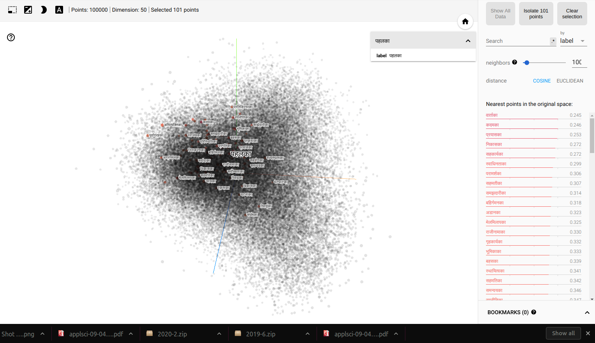

## Training Word Embedding using Gensim ##

Gensim provides platform to train word embedding on your custom data. Please follow following steps.

- Create Virtual Environment

  ```

  virtualenv --python=<your python path> <name_env>

  ```
  
- Activate the Environment

  ```

  source <name of environment>/bin/activate

 ```
 
- Install the requirements.

  ```

  pip install -r requirements.txt

  ```
  
- Make sure you have made an .env file with PROJECT_PATH, MODEL_NAME, LANGUAGE (language of text you are training) and path of your data file.

  Your data should be a text file with clean, preprocessed texts, a sentence per line.

- Now, train by running the run file.


## Loading Gensim Model ##
After running the run.py file, your model will be saved and you can load the gensim model with the module provided inside the file itself.

## Fetching Word Vectors##
After loading the gensim model, you can fetch vector og single word as follow.

## Getting Similar Words ##

Refere the module return_similar.

For more features. DO follow the following tutorial.
[Gensim](https://radimrehurek.com/gensim/auto_examples/tutorials/run_word2vec.html#sphx-glr-auto-examples-tutorials-run-word2vec-py)


## Visualization of Gensim Word Vector Modules in Tensorflow

To visualize the trained embedding in the tensorboard. Run the get_tensorboard_representation.py file. Make sure you have valid model path. 

After creating model checkpoint of the embedding and making a corresponding metadata file containing words. 
To visualize:

```
tensorboard --logdir=tensorboard/

```

Here is the screenshot of the model I trained and visualized.




